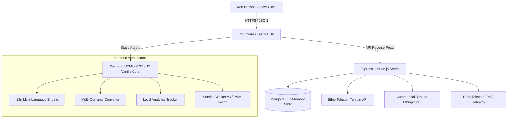

# MERKATO Architecture & System Design

## System Highlights
- **Zero Heavy Bundler Dependency**: Pure semantic HTML5, modern CSS3 variables, and vanilla ES6+ for maximum load speed on Ethiopian networks.
- **Service Worker v3 Cache-First Architecture**: Instant loading across slow 3G/4G connections.
- **Privacy-First Analytics**: Completely local event tracking without invasive third-party cookies.
